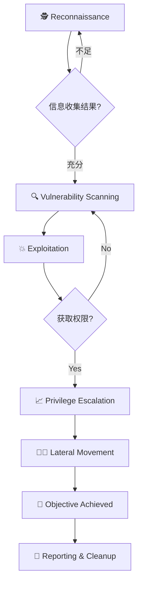
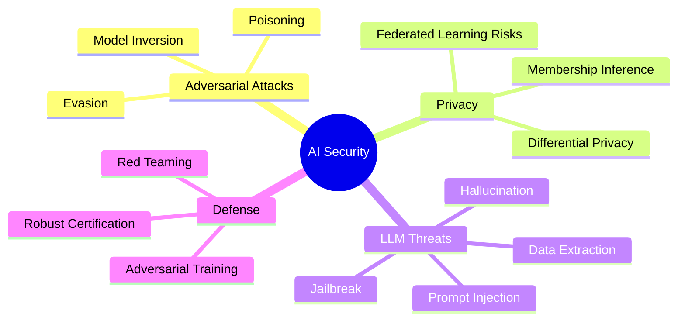

## Welcome to SecLab

SecLab 是一个专注于 **网络安全 · 密码学 · AI 安全** 的技术博客。本文将展示 Markdown 渲染能力，包括代码高亮、LaTeX 数学公式以及 Mermaid 流程图。

---

## Code Blocks

代码块由 [Expressive Code](https://expressive-code.com/) 渲染，支持行号、折叠和复制按钮。

### Python — AES 加密演示

```python
from Crypto.Cipher import AES
from Crypto.Util.Padding import pad, unpad


def aes_encrypt(plaintext: bytes, key: bytes) -> bytes:
    """AES-256-CBC 加密"""
    cipher = AES.new(key, AES.MODE_CBC)
    ct = cipher.encrypt(pad(plaintext, AES.block_size))
    return cipher.iv + ct


def aes_decrypt(ciphertext: bytes, key: bytes) -> bytes:
    """AES-256-CBC 解密"""
    iv = ciphertext[:AES.block_size]
    ct = ciphertext[AES.block_size:]
    cipher = AES.new(key, AES.MODE_CBC, iv)
    return unpad(cipher.decrypt(ct), AES.block_size)
```

### C — 格式化字符串漏洞

```c
#include <stdio.h>

int main() {
    char flag[64] = "FLAG{t3mpl4te_str1ng_leak}";
    char buf[128];

    fgets(buf, sizeof(buf), stdin);
    printf(buf);  // vulnerability: format string bug

    return 0;
}
```

### Shell — Nmap 扫描

```shell
#!/bin/bash
# 快速端口扫描脚本
TARGET="10.0.0.1"

echo "[*] Scanning ${TARGET}..."
nmap -sV -sC -p- --min-rate=1000 -T4 ${TARGET} \
  -oA scan_results/nmap_${TARGET}_$(date +%Y%m%d)
echo "[+] Scan complete"
```

---

## LaTeX 数学公式

支持行内公式与块级公式，使用 KaTeX 渲染。

### 行内公式

Shannon 熵的定义：$H(X) = -\sum_{i=1}^{n} P(x_i) \log_2 P(x_i)$

RSA 加密：$c \equiv m^e \pmod{n}$，解密：$m \equiv c^d \pmod{n}$

### 块级公式

**椭圆曲线离散对数问题 (ECDLP)：**

$$
Q = k \cdot G \quad (k \in \mathbb{Z}_n)
$$

已知 $Q$ 和 $G$，求 $k$ 是计算上不可行的。

**格密码中的 LWE 问题：**

$$
\mathbf{b} = \mathbf{A} \mathbf{s} + \mathbf{e} \pmod{q}
$$

其中 $\mathbf{A} \in \mathbb{Z}_q^{m \times n}$，$\mathbf{s} \in \mathbb{Z}_q^n$，$\mathbf{e} \in \mathbb{Z}^m$ 为小误差向量。

**贝叶斯定理在入侵检测中的应用：**

$$
P(\text{attack} \mid \text{alert}) = \frac{P(\text{alert} \mid \text{attack}) \cdot P(\text{attack})}{P(\text{alert})}
$$

---

## Mermaid 流程图

### 渗透测试流程



### AI 安全威胁分类



---

> **以上所有内容均在本博客中正确渲染**：代码高亮（Expressive Code + JetBrains Mono）、LaTeX 数学公式（KaTeX）、Mermaid 流程图。
>
> 如果某个模块无法正常显示，请检查 `pnpm dev` 控制台日志。
